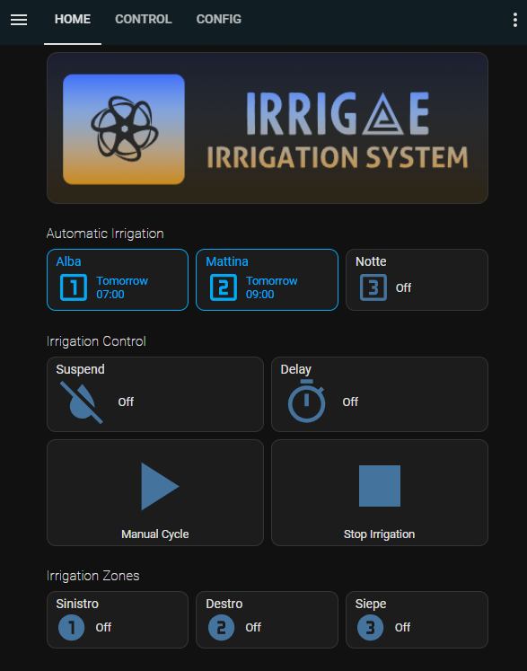
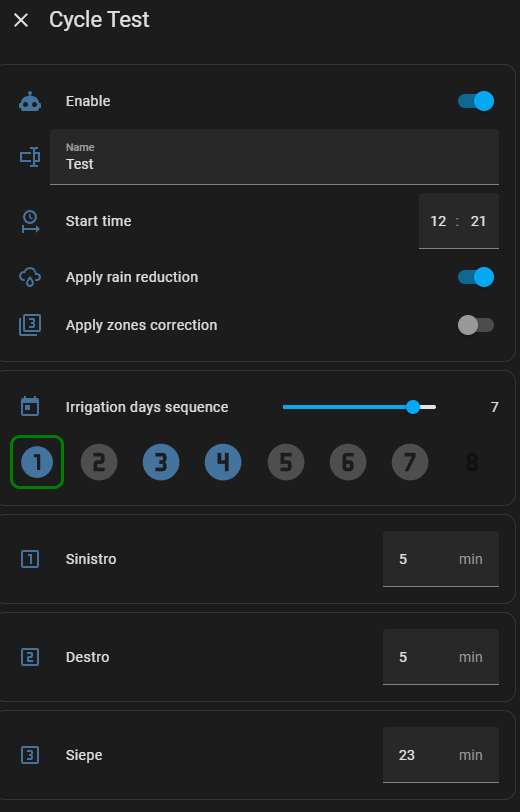

# irrigae

Gestione completa dell'irrigazione facilmente adattabile a qualsiasi installazione di Home Assistant.

## Funzionalità:
 - Fino a 6 zone di irrigazione
 - Fino a 3 programmi di irrigazione automatici
 - Irrigazione manuale tutte le zone
 - Irrigazione manuale singola zona
 - Sospensione irrigazione automatica fino a qualche giorno
 - Ritardo irrigazione automatica fino a qualche ora
 - Riduzione irrigazione basata su previsioni pioggia ore successive
 - Riduzione irrigazione basata su precipitazioni pioggia ora precedenti
 - Invio notifiche su cellulare/alexa/etc.
 - Report ultime irrigazioni
 - Spegnimento di sicurezza per periodo invernale

### Funzionalità avanzate per utenti esperti:
 - Aggiunta di propri sensori per previsioni pioggia/precipitazioni/umidità terreno 
 - Aggiunta di un sensore per ogni zona per il controllo dei minuti irrigazione (utile per cisterne, umidità terreno, ecc)
 - Aggiunta di un proprio script per la notifica delle attività

## Installazione
Irrigae è un insieme di entità, script, timer, automazioni e cards che devono essere aggiunte manualmente alla vostra installazione di HomeAssistant.
Per farlo è sufficiente copiare le cartelle all'interno di /config e riavviare Home Assistant. 
Irrigae è composto di due parti fondamentali: il motore di contollo dell'irrigazione e l'interfaccia grafica. Gli utenti avanzati possono creare/modificare l'interfaccia grafica a piacere per adattarla alla propria dashboard o al proprio stile. 

### Prerequisiti
Devono essere installati e funzionanti i seguenti componenti di terze parti:
- lovelace_gen          (https://github.com/thomasloven/hass-lovelace_gen)
- browser_mod           (https://github.com/thomasloven/hass-browser_mod)
- button_card           (https://github.com/custom-cards/button-card)
- config-template-card  (https://github.com/iantrich/config-template-card) 
- hui-element           (https://github.com/thomasloven/lovelace-hui-element)

