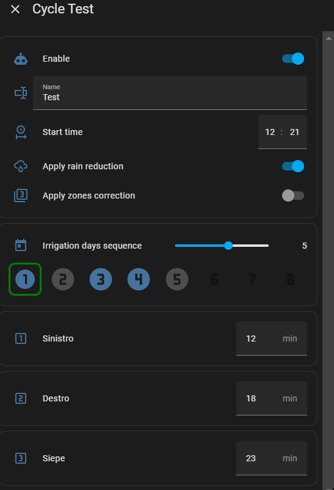

# irrigae

Sistema di irrigazione avanzato per Home Assistant.
Si adatta a qualsiasi configurazione home assistant, è sufficiente avere delle entità di tipo switch che controllano le valvole di irrigazione.
Non sono richieste particolari abilità per l'installazione. 


## Funzionalità:
 - Fino a 6 zone di irrigazione
 - Fino a 3 programmi di irrigazione automatici
 - Selezione giorni di irrigazione basati su sequenza fino a 8 giorni
 - Irrigazione manuale tutte le zone
 - Irrigazione manuale singola zona
 - Sospensione irrigazione automatica fino a qualche giorno
 - Ritardo irrigazione automatica fino a qualche ora
 - Riduzione irrigazione basata su previsioni pioggia ore successive
 - Riduzione irrigazione basata su precipitazioni pioggia ora precedenti
 - Invio notifiche su cellulare/alexa/etc.
 - Report ultime irrigazioni
 - Spegnimento di sicurezza per periodo invernale

### Funzionalità avanzate per utenti esperti:
 - Aggiunta di propri sensori per previsioni pioggia/precipitazioni/umidità terreno 
 - Aggiunta di un sensore per ogni zona per il controllo dei minuti irrigazione (utile per cisterne, umidità terreno, ecc)
 - Aggiunta di un proprio script per la notifica delle attività


## Installazione
Irrigae è un insieme di entità, script, timer, automazioni e cards che devono essere aggiunte manualmente alla vostra installazione di HomeAssistant.
Per farlo è sufficiente copiare le cartelle all'interno di /config e riavviare Home Assistant. 
Irrigae è composto di due parti fondamentali: il motore di contollo dell'irrigazione e l'interfaccia grafica. Gli utenti avanzati possono creare/modificare l'interfaccia grafica a piacere per adattarla alla propria dashboard o al proprio stile. 

### Prerequisiti
- Home assistant versione minima 2024.3
- Database standard di Home Assistant (il funzionamento dei sensori SQL non è garantito se avete cambiato il database)
- Integrazione standard Meteorologisk institutt (Met.no) (il funzionamento non è garantito se avete intallato altre integrazione meteo)

Per l'interfaccia grafica devono essere installati e funzionanti i seguenti componenti di terze parti:
- lovelace_gen          (https://github.com/thomasloven/hass-lovelace_gen)
- browser_mod           (https://github.com/thomasloven/hass-browser_mod)
- button_card           (https://github.com/custom-cards/button-card)
- config-template-card  (https://github.com/iantrich/config-template-card) 
- hui-element           (https://github.com/thomasloven/lovelace-hui-element)

Fate riferimento alle rispettive documentazioni per una corretta installazione. Questi componenti sono fondamentali per l'interfaccia grafica, se qualcosa non funziona significa che sono installati in modo scorretto. Se pensate di creare la vostra interfaccia grafica non ne avrete bisogno.

### Cartelle
Scaricate e aggiungete le seguenti cartelle:
- i files in packages/irrigae vanno scaricati e copiati in /config/packages/irrigae (create i percorsi se non esistono)
- i files in custom_templates/irrigae vanno scaricati e copiati in /config/custom_templates/irrigae (create i percorsi se non esistono)
- i files in irrigae_ui vanno scaricati e copiati in /config/www/irrigae_ui (create i percorsi se non esistono)

### configuration.yaml
Nel file di configurazione principale di HomeAssistant (configuration.yaml) dovete aggiungere se non sono già presenti le seguenti configurazioni:


```yaml

homeassistant:
  packages: !include_dir_named packages

# Lovelace new dashboards
lovelace_gen:

lovelace:
  mode: storage
  dashboards:
    lovelace-irrigation:
      mode: yaml
      title: Irrigation
      icon: mdi:watering-can
      show_in_sidebar: true
      filename: www/irrigae_ui/dashboard.yaml

```
Al termine dell'installazione riavviare Home Assistant. Dopo il riavvio nella Sidebar troverete la nuova voce Irrigation.

## Configurazione iniziale sistema (utenti basic)
Selezionando Irrigation dalla Sidebar entrerete nella Home dell'irrigazione. Tutte le etichette e gli stati saranno visualizzati come "Unknown". 
E' normale, dovete ancora configurare il sistema. Per farlo selezionate la tab "CONFIG"


- Scegliete quanti cicli di irrigazione automatica volete gestire (da 1 a 3), consiglio 3. 
- Scegliete il numero di zone che il vostro sistema di irrigazione gestisce (da 1 a 6)
- Inserite per ogni zona il nome dell'entità di tipo switch che controlla la valvola
- Se volete che il vostro sistema consideri le previsioni di pioggia aggiungete l'entità weather della vostra zona geografica
- Inserite quindi il numero di ore che volete tenere in considerazione per le previsioni di pioggia e per le piogge precedenti. 
  Dai test risulta che 15h e 18h siano valori ottimali, ma devono tener conto della zona in cui vivete e del tempo di evaporazione.
- Se volete essere avvisati sulle attività del sistema di irrigazione, inserite quindi il servizio di notifica per il vostro cellulare/alexa,ecc.
- E possibile quindi inserire anche il tempo di preavviso con cui volete ricevere la notifica prima dell'avvio di un'irrigazione automatica. 
  Questo vi consente per esempio di avere il tempo per bloccarla o spostare eventuali oggetti che non devono essere bagnati. Un valore di 30 per esempio invierà la notifica 30 secondi prima dell'avvio effettivo dell'irrigazione.

I parametri non presenti in questo elenco sono per utenti esperti, in grado di creare sensori e script. Vedere sezione apposita.

## Attivazione sitema e controllo 
Selezionando la tab "CONTROL" potrete ora attivare e disattivare le farie funzionalità del sistema di irrigazione


- Abilitare il sistema. Con il sistema disabilitato, nessuna zona di irrigazione funzionerà. La disattivazione del sistema serve (per esempio) quando si chiude l'acqua durante l'inverno e permette di evitare avvi involontari dell'irrigazione che potrebbero danneggiare l'impianto.
- Selezionare il tipo di notifiche che si desidera ricevere. Al momento della scrittura di questo documento non c'è molta differenza, selezionare ALL per ricevere tutte le notifiche o No, per non ricevere nulla
- Abilitare i sistemi di riduzione dell'irrigazione per previsioni pioggia o per precipitazioni precedenti a seconda delle proprie necessità.
- In caso di utilizzo della riduzione irrigazione per pioggia configurare i valori Reduce Irrigation e Stop Irrigation sia per precedenti precipitazioni che per precipitazioni previste. I valori 2mm e 5mm danno buoni risultati. 
  Il comportamento dei due campi è il seguente:
  Il sistema comincia a ridurre i minuti di irrigazione per ogni singola zona quando la pioggia supera il primo limite, quando la pioggia supera il secondo limite il sistema non irriga. Un valore di pioggia compreso tra i due limiti riduce l'irrigazione in proporzione. Esempio pratico:
  Supponiamo di configurare i due limiti cosi':
  Limite basso: 2mm
  Limite alto: 6mm
  Se le previsioni pioggia fossero di 4 millimetri, l'irrigazione sarebbe ridotta al 50% per ogni singola zona. Se le previsioni piogga fossero di 1mm l'irrigazione sarebbe normale. Se l'irrigazione fosse 7mm l'irrigazione sarebbe annullata.
  I valori sono da inserire sia per le precipitazioni precedenti, sia per le precipitazioni previste. Le rispettive riduzioni vengono moltiplicate.
  Quindi il sistema tiene conto sia delle piogge cadute ieri che delle piogge previste oggi. 

## Home irrigazione
Terminate le due configurazioni precedenti siete pronti per provare il sistema di irrigazione. Selezionate quindi la pagina HOME e provate.


Nella prima riga vengono visualizzati i cicli automatici che avete deciso di utilizzare (da 1 a 3). Premendo il pulsante entrerete in configurazione dei cicli.



- Enabled: Potete abilitare o disabilitare questo ciclo
- Name: Potete assegnare un nome a piacere al vostro ciclo
- Start time: ora di avvio del ciclo
- Apply rain reduction: vi consente di decidere se abilitare la riduzione per pioggia per questo ciclo. La riduzione per pioggia può essere disabilitata per esempio se il ciclo si riferisce a zone protette dagli agenti atmosferici
- Apply zone correction: Abilita la correzione dei tempi di irrigazione delle zone per altri sensori, come per esempio cisterne o sensori di umidità del terreno (utenti avanzati)
- Irrigation days sequence: Potete scegliere una sequenza di giorni (fino a 8) in cui alternare i giorni di irrigazione. I giorni evidenziati sono quelli in cui il sistema farà partire l'irrigazione, i giorni non evidenziati l'irrigazione non partirà. Fare singolo click sul giorno per attivarlo/disattivarlo.
  Esempio: Se volete irrigare a giorni alterni, selezionate 2 giorni di sequenza e abilitate il primo giorno e disabilitate il secondo giorno.
  Il giorno corrente è rappresentato dal riquadro verde. Il giorno corrente si sposta automaticamente a mezzanotte. Se volete cambiarlo manualmente fate doppio click. Si chiuderà la scheda, se la riaprite vedrete che il giorno corrente è stato aggiornato.
  - Minuti di irrigazione: per ogni zona del vostro impianto potrete decidere i minuti di irrigazione, se lasciate il valore a zero, quella zona non verrà irrigata.

La parte sucessiva della HOME consente di controllare l'irrigazione.
- Suspend: Consente di sospendere l'irrigazione automatica per un po' di giorni (tutti i cicli). Se per esempio dalle vostre osservazioni notate che il terreno è già troppo bagnato potete sospendere l'irrigazione per tot giorni.
Lo stesso effetto si ottiene ovviamente anche disabilitando i cicli di irrigazione, ma il vantaggio della sospensione sta nel fatto che non dovrete ricordarvi di riattivarli, infatti con la sospensione al termine del  periodo di stop, l'irrigazione torna a funzionare autonomamente.
- Delay: Questa funziona consente di ritardare l'irrigazione. Supponiamo che durante il ciclo di irrigazione dobbiate attraversare il giardino. Grazie alla funzione di delay potrete ritardare l'irrigazione per tutto il tempo che vi serve per uscire dalla zona di irrigazione. La funzione di delay funziona sia prima dell'avvio dell'irrigazione (nel qual caso il timer di ritardo parte esattamente all'ora prevista dal ciclo), sia mentre gli irrigatori stanno andando (nel qual caso l'irrigazione si blocca immediatamente e riprende dopo il tempo che gli avete indicato)   
- Manual cycle: Permette di avviare un ciclo manuale di tutte le zone con tempi da voi selezionati
- Stop irrigation: Arresta immediatamente qualsiasi tipo di irrigazione (manuale o automatica o zone)

L'ultima parte della HOME consente di avviare gli irrigatori di zona manualmente per un tempo da voi scelto.

## Funzioni avanzate
(TODO)

## Multilanguage
Attualmente irrigae è disponibile solo in lingua inglese.

## Animation

